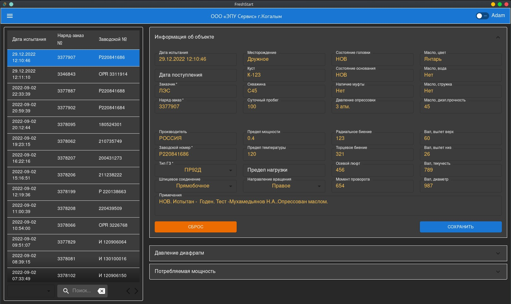
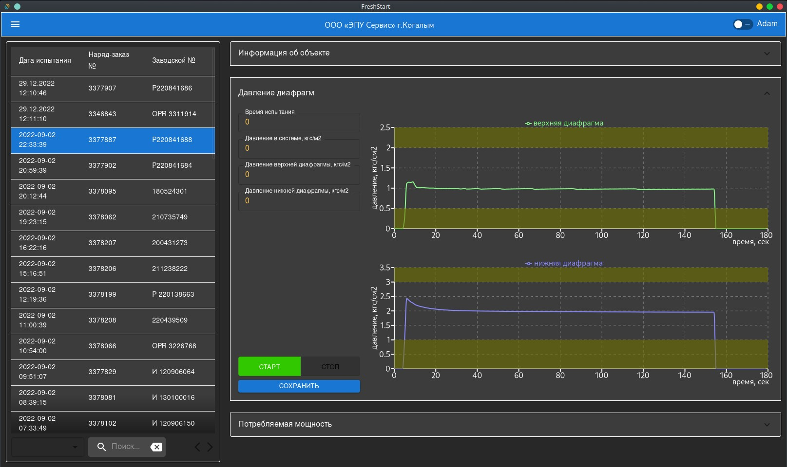
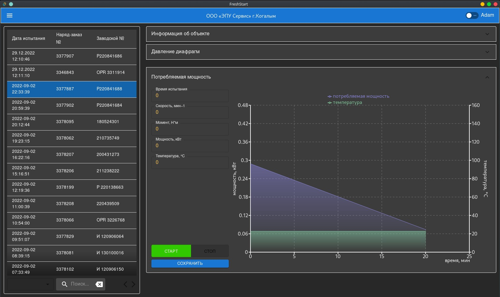

# Испытание Гидрозащиты

Программное обеспечение стенда испытания гидрозащиты и опорных модулей. Испытания включают в себя:
+ измерение давлений срабатывания верхней и нижней диафрагм
+ измерение потребляемой мощности
  - со статической нагрузкой для ГЗ
  - с поэтапным увеличением нагрузки для ОМ
  - замер вибрации

#### Использованые технологии

- back-end:   __Tauri__
- front-end:  __React + MaterialUI__
- хранение:   __SQLite3__
- периферия:  __Adam 5000 TCP__

### `npm run tauri dev`

